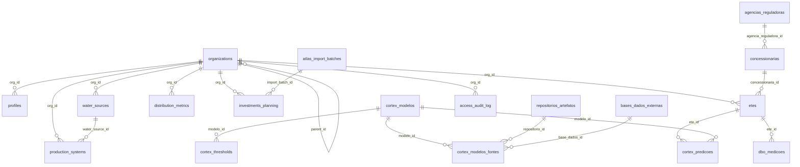
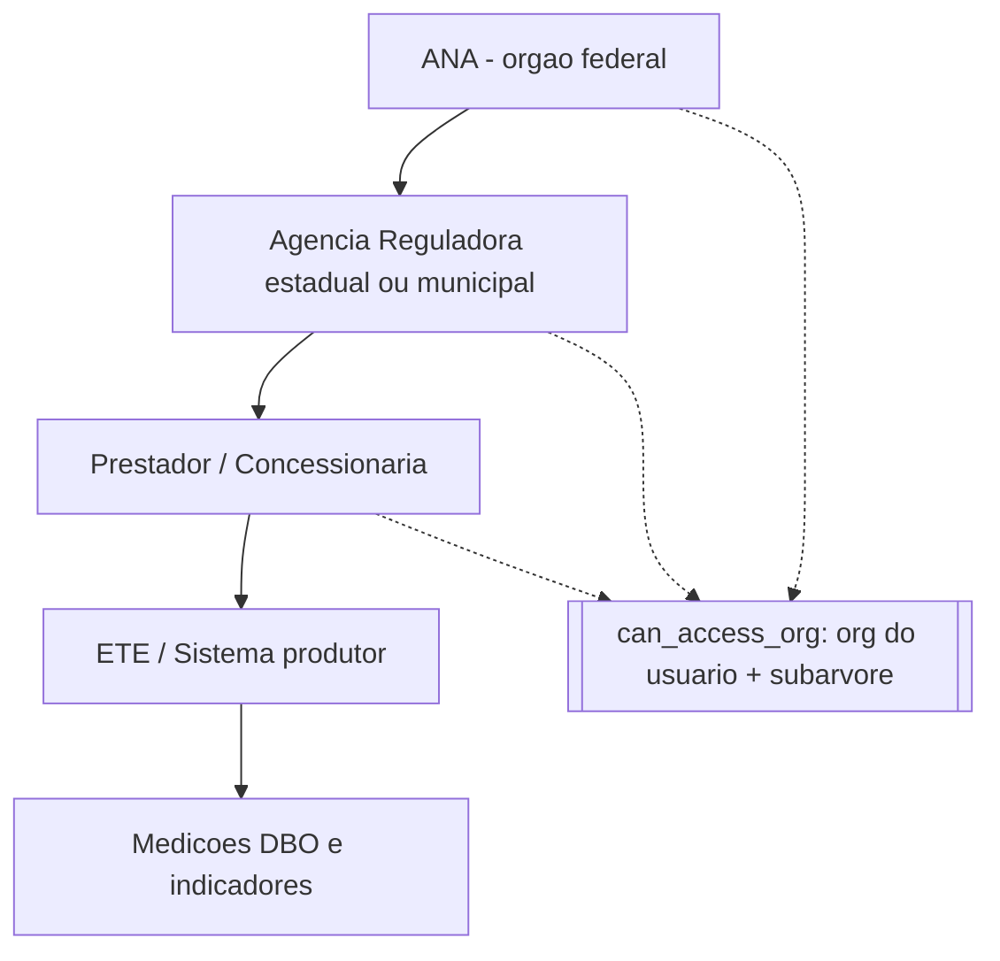
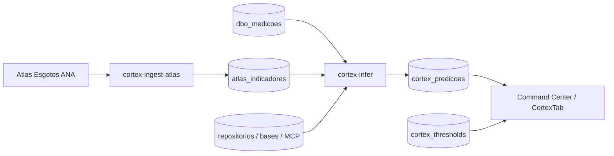

# Diagrama Entidade-Relacionamento — HydrosNet

Fonte Mermaid abaixo (também disponível em `/mnt/documents/HydrosNet_ER.mmd`).

## Hierarquia de visibilidade

## Fluxo Córtex IA

Tabelas sem relacionamento por chave estrangeira (isoladas por natureza): `user_roles` (liga a `auth.users`),
`audit_log`, `api_probe_log`, `atlas_indicadores`, `ldap_config`, `smtp_config`, `sei_config`,
`system_parameters`, `cron_config`.
